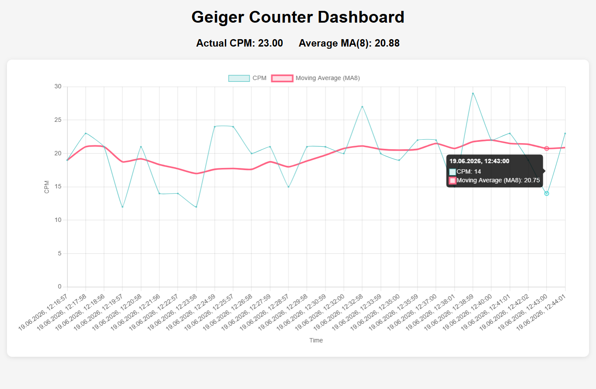

# ☢️ RadiationMonitor
 
**Radiation Monitor Logger** <br>
It is lightweight logger and live web dashboard for a Geiger counter. It reads pulses from a Geiger–Müller tube, calculates **CPM** (Counts Per Minute) in real time, smooths the signal with an **8-sample moving average (MA8)**, and plots everything on an interactive time-series dashboard.





## ✨ Features
 
- **REST API** to push and pull readings (`/api/readings`)
- **Pydantic validation** on every incoming reading, with structured error responses
- **CPM** logging with automatic timestamps
- **Moving average (MA8)** over the last 8 samples for a smooth trend line
- **Rolling 24-hour window** served to the dashboard
- **Automatic cleanup** of old rows on each insert
- **Live dashboard** rendered server-side (`dashboard.html`)


## 🚀 Installation
 
```bash
# 1. Clone the repository
git clone https://github.com/<your-username>/RadiationMonitor.git
cd RadiationMonitor
 
# 2. Install dependencies
uv sync
 
# 3. create a virtual environment
source .venv/bin/activate
```


## ▶️ Running
 
```bash
python main.py
```
 
Then open the dashboard:
 
```
http://localhost:5000
```


## 🔌 API reference
 
### `POST /api/readings`
Submit a new reading. The body is validated against the `GeigerReading` model. If `timestamp` is omitted it is set automatically to the current UTC time.
 
**Request body**
```json
{ "cpm": 23, "usvh": 0.15 }
```
 
**`201 Created`**
```json
{
  "status": "ok",
  "saved": { "cpm": 23, "usvh": 0.15, "timestamp": "2026-06-19T12:44:01" }
}
```


**Example**
```bash
curl -X POST http://localhost:5000/api/readings \
     -H "Content-Type: application/json" \
     -d '{"cpm": 23, "usvh": 0.15}'
```


### `GET /api/readings`
Return all readings from the last **24 hours**.
 
**`200 OK`**
```json
[
  { "cpm": 14, "usvh": 0.09, "timestamp": "2026-06-19T12:43:00" },
  { "cpm": 23, "usvh": 0.15, "timestamp": "2026-06-19T12:44:01" }
]
```

### `GET /`
Serve the dashboard page (`dashboard.html`).


## Configure ESP32

### 1. Flash MicroPython
```bash
pip install esptool
# download the .bin from https://micropython.org/download/ESP32_GENERIC/
esptool.py --port /dev/ttyUSB0 erase_flash
esptool.py --port /dev/ttyUSB0 --baud 460800 write_flash 0x1000 ESP32_GENERIC-xxxx.bin
```

### 2. Upload the firmware files

With the [Thonny](https://thonny.org/) IDE: select the *MicroPython (ESP32)*
interpreter, then save each file from `firmware` folder to the device.
Then update wifi credentials in `wifi_connection.py` file.
After a reset the board connects to
WiFi and starts sending a reading every 60 seconds.